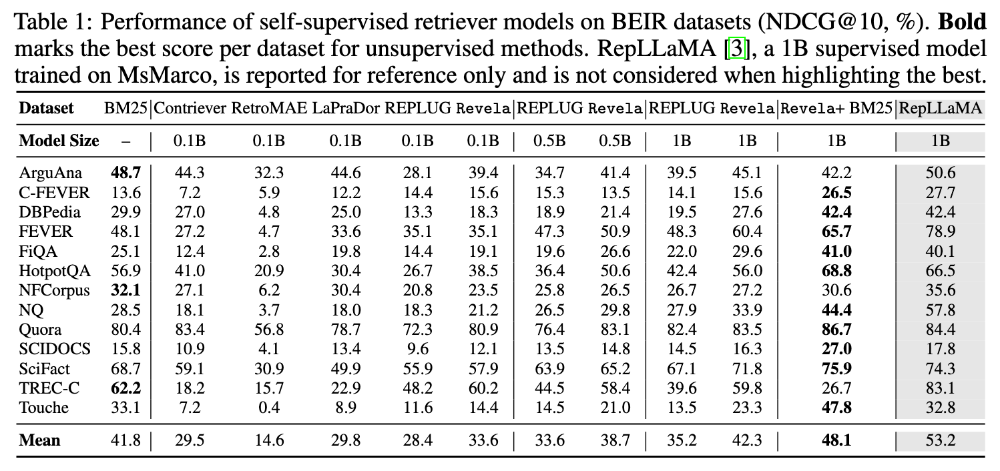
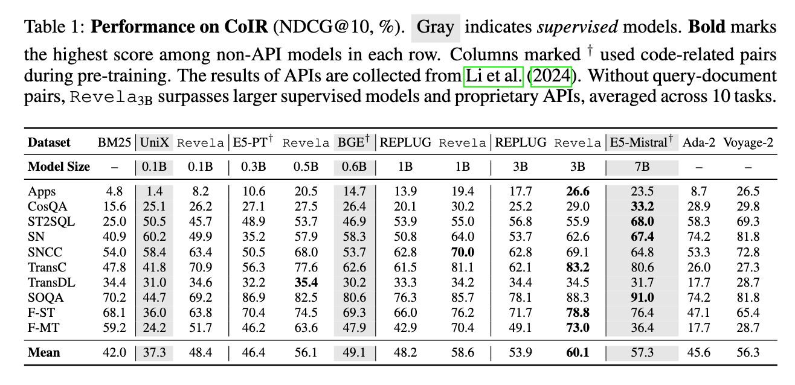

<h1 align="center">Revela: Dense Retriever Learning via Self-supervised LM Training</h1>

<h4 align="center">
    <p>
        <a href="">📑 Paper</a> |
        <a href="#installation">🔧 Installation</a> |
        <a href="#resources">📚 Resources</a> |
        <a href="#training">🚀 Training</a> |
        <a href="#eval"> 📊 Evaluation</a> |
        <a href="#citing">📄 Citing</a>
    </p>
</h4>

> **Abstract:**
>
> Retrievers, represented by dense retrievers, play a vital role in accessing external and specialized knowledge to augment LMs.
Training dense retrievers typically requires annotated query-document pairs, which are costly and hard to scale—motivating growing interest in self-supervised solutions. However, current self-supervised approaches—such as contrastive learning, masked autoencoding, and LM-based distillation—suffer from key limitations, including oversimplified assumptions, lack of explicit negatives, or reliance on frozen LMs.
>
> In this work, we propose <code>Revela</code>, a unified and scalable framework for self-supervised retriever learning via joint retriever-LM training.
<code>Revela</code> models semantic dependencies among passages by conditioning generation on both local and cross-passage context through a novel in-batch attention mechanism.
This attention is weighted by retriever-computed similarity scores, enabling the retriever to be optimized as part of language modeling.
We evaluate <code>Revela</code> on both general-domain (BEIR) and domain-specific (CoIR) benchmarks across various retriever backbones.
With comparable parameter scales, it outperforms REPLUG by relative margins of 18.3\% and 14.4\%, respectively.
Performance scales with model size, demonstrating the effectiveness and scalability of our approach and underscoring its potential as a promising solution for self-supervised retriever learning.

<h2 id="installation">Installation</h2>

To begin, set up the conda environment using the following command:

```
conda env create -f environment.yml
```

In <code>Revela</code>, we modify the transformers architecture to incorporate **in-batch** attention. To enable this, install a customized version of the `transformers` library:

```
pip uninstall transformers
pip install git+https://github.com/TRUMANCFY/transformers.git@adapt
```

Finally, we train the model in a modular setup. To install the local package in editable mode, run:

```
cd src/tevatron
pip install -e .
```

<h2 id="resource">Resource</h2>

### Data

### Models

| Model Name    | Base Model                                                                 | Training Corpus | Link                                                   |
|---------------|----------------------------------------------------------------------------|------------------|--------------------------------------------------------|
| Revela-1b     | [meta-llama/Llama-3.2-1B](https://huggingface.co/meta-llama/Llama-3.2-1B)   | Wikipedia        | [Revela-1b](https://huggingface.co/trumancai/Revela-1b)     |
| Revela-500m   | [Qwen/Qwen2.5-0.5B](https://huggingface.co/Qwen/Qwen2.5-0.5B)               | Wikipedia        | [Revela-500m](https://huggingface.co/trumancai/Revela-500M) |
| Revela-135m   | [HuggingFaceTB/SmolLM2-135M](https://huggingface.co/HuggingFaceTB/SmolLM2-135M) | Wikipedia    | [Revela-135m](https://huggingface.co/trumancai/Revela-135M) |


<h2 id="training">Training</h2>

<h2 id="eval">Evaluation</h2>

<p align="center">
  
</p>


<p align="center">
  
</p>


<h2 id="citing">Citing</h2>
