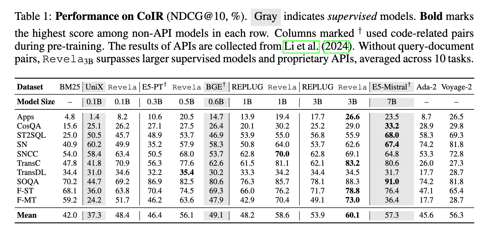
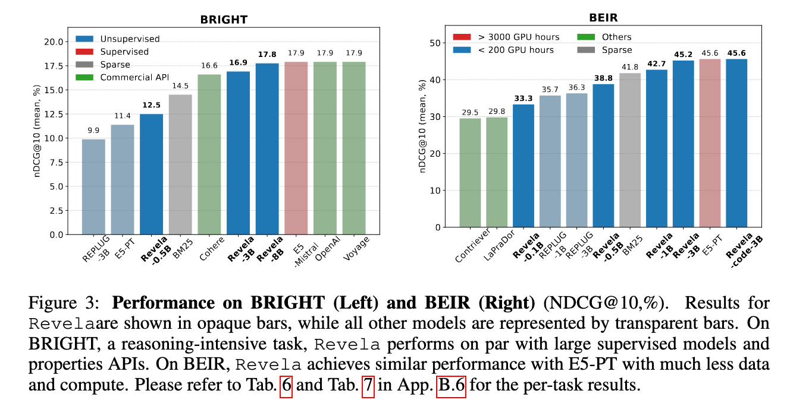

<h1 align="center">Revela: Dense Retriever Learning via Language Modeling</h1>

<h4 align="center">
    <p>
        <a href="https://www.arxiv.org/abs/2506.16552">📑 Paper</a> |
        <a href="#installation">🔧 Installation</a> |
        <a href="#resources">📚 Resources</a> |
        <a href="#training">🚀 Training</a> |
        <a href="#eval"> 📊 Evaluation</a> |
        <a href="#citing">📄 Citing</a>
    </p>
</h4>

<strong>TL;DR: Self-supervised retriever learning is framed as next-token prediction with retrieval-weighted in-batch attention. Trained only on raw text, the method delivers strong performance on code, reasoning-intensive, and general-domain retrieval.
</strong>


> **Abstract:**
>
> Dense retrievers play a vital role in accessing external and specialized knowledge to augment language models (LMs).
> Training dense retrievers typically requires annotated query-document pairs, which are costly to create and scarce in specialized domains (e.g., code) or in complex settings (e.g., requiring reasoning).
> These practical challenges have sparked growing interest in self-supervised retriever learning.
> Since LMs are trained to capture token-level dependencies through a *self-supervised* learning objective (i.e., next token prediction), we can analogously cast retrieval as learning dependencies among chunks of tokens.
> This analogy naturally leads to the question: *How can we adapt self-supervised learning objectives in the spirit of language modeling to train retrievers?*
>
> To answer this question, we introduce <code>Revela</code>, a unified and scalable training framework for self-supervised retriever learning via language modeling.
> <code>Revela</code> models semantic dependencies among documents by conditioning next token prediction on local and cross-document context through an *in-batch attention* mechanism.
> This attention is weighted by retriever-computed similarity scores, enabling the retriever to be optimized as part of language modeling.
> We evaluate <code>Revela</code> on domain-specific (CoIR), reasoning-intensive (BRIGHT), and general-domain (BEIR) benchmarks across various retriever backbones.
> Without annotated or synthetic query-document pairs, <code>Revela</code> surpasses larger supervised models and proprietary APIs on CoIR and matches them on BRIGHT.
> It achieves BEIR’s unsupervised SoTA with ~1000× less training data and 10× less compute.
> Performance increases with batch size and model size, highlighting <code>Revela</code>’s scalability and its promise for self-supervised retriever learning.


<h2 id="installation">Installation</h2>

To begin, set up the conda environment using the following command:

```
conda env create -f environment.yml
```

In <code>Revela</code>, we modify the transformers architecture to incorporate **in-batch** attention. To enable this, install a customized version of the `transformers` library:

```
pip uninstall transformers
pip install git+https://github.com/TRUMANCFY/transformers.git@adapt
```

Finally, we train the model in a modular setup. To install the local package in editable mode, run:

```
cd src/tevatron
pip install -e .
```

<h2 id="resources">Resources</h2>

### Data


| Dataset                    | Source                                                                                                                                                              | Number of Batches | Batch Size |
|----------------------------|---------------------------------------------------------------------------------------------------------------------------------------------------------------------|-------------------|------------|
| [Revela Training Corpus](https://huggingface.co/datasets/trumancai/revela_training_corpus)     | [Wikipedia](https://huggingface.co/datasets/Tevatron/wikipedia-nq-corpus)                                                                                           | 320,000           | 16         |
| [Revela Code Training Corpus](https://huggingface.co/datasets/trumancai/revela_code_training_corpus) | [Stackoverflow Posts](https://huggingface.co/datasets/code-rag-bench/stackoverflow-posts), [Online Tutorials](https://huggingface.co/datasets/code-rag-bench/online-tutorials), [Library Documentation](https://huggingface.co/datasets/code-rag-bench/library-documentation) | 358,763           | 16         |


### Models

| Model Name    | Base Model                                                                 | Training Source |
|---------------|----------------------------------------------------------------------------|------------------|
| [Revela-3b](https://huggingface.co/trumancai/Revela-3b)     | [meta-llama/Llama-3.2-3B](https://huggingface.co/meta-llama/Llama-3.2-3B)   | [Wikipedia](https://huggingface.co/datasets/Tevatron/wikipedia-nq-corpus)        | 
| [Revela-1b](https://huggingface.co/trumancai/Revela-1b)     | [meta-llama/Llama-3.2-1B](https://huggingface.co/meta-llama/Llama-3.2-1B)   | [Wikipedia](https://huggingface.co/datasets/Tevatron/wikipedia-nq-corpus)        | 
| [Revela-500m](https://huggingface.co/trumancai/Revela-500M) | [Qwen/Qwen2.5-0.5B](https://huggingface.co/Qwen/Qwen2.5-0.5B)               | [Wikipedia](https://huggingface.co/datasets/Tevatron/wikipedia-nq-corpus)        |
|  [Revela-code-3b](https://huggingface.co/trumancai/Revela-code-3b)     | [meta-llama/Llama-3.2-1B](https://huggingface.co/meta-llama/Llama-3.2-3B)   | [Stackoverflow Posts](https://huggingface.co/datasets/code-rag-bench/stackoverflow-posts) + [Online Tutorials](https://huggingface.co/datasets/code-rag-bench/online-tutorials) + [Library Documentation](https://huggingface.co/datasets/code-rag-bench/library-documentation)        |
|  [Revela-code-1b](https://huggingface.co/trumancai/Revela-code-1b)     | [meta-llama/Llama-3.2-1B](https://huggingface.co/meta-llama/Llama-3.2-1B)   | [Stackoverflow Posts](https://huggingface.co/datasets/code-rag-bench/stackoverflow-posts) + [Online Tutorials](https://huggingface.co/datasets/code-rag-bench/online-tutorials) + [Library Documentation](https://huggingface.co/datasets/code-rag-bench/library-documentation)        |
| [Revela-code-500m](https://huggingface.co/trumancai/Revela-code-500M) | [Qwen/Qwen2.5-0.5B](https://huggingface.co/Qwen/Qwen2.5-0.5B)               | [Stackoverflow Posts](https://huggingface.co/datasets/code-rag-bench/stackoverflow-posts) + [Online Tutorials](https://huggingface.co/datasets/code-rag-bench/online-tutorials) + [Library Documentation](https://huggingface.co/datasets/code-rag-bench/library-documentation)        |


<h2 id="training">Training</h2>
The training script can be found at `train.sh` under DeepSpeed training framework.


```
export CUDA_VISIBLE_DEVICES=0,1,2,3
export TRITON_PRINT_AUTOTUNING=1

export ROOT_DIR=./
export OUTPUT_DIR=...
export RUN_NAME=...

deepspeed --include localhost:0,1,2,3 --master_port 6022 --module tevatron.llm_retriever.driver.train \
  --deepspeed $ROOT_DIR/deepspeed/ds_zero3_config.json \
  --output_dir $OUTPUT_DIR \
  --model_name_or_path meta-llama/Llama-3.2-1B \
  --lora \
  --lora_r 256 \
  --lora_target_modules q_proj,k_proj,v_proj,o_proj,down_proj,up_proj,gate_proj \
  --save_steps 500 \
  --bm25_retrieval_file $DATA_PATH \
  --add_passage_prefix True \
  --add_query_prefix True \
  --first_half True \
  --bf16 \
  --pooling eos \
  --append_eos_token \
  --normalize \
  --temperature 0.01 \
  --attn_temperature 0.0001 \
  --per_device_train_batch_size 1 \
  --train_group_size 16 \
  --learning_rate 1e-4 \
  --passage_max_len 157 \
  --num_train_epochs 1 \
  --gradient_accumulation_steps 8 \
  --logging_steps 1 \
  --overwrite_output_dir \
  --warmup_steps 100 \
  --resume latest \
  --top_k 16 \
  --run_name $RUN_NAME
```

<h2 id="eval">Evaluation</h2>

We can evaluate the trained models with customized `mteb`.

```
from mteb.model_meta import ModelMeta
from mteb.models.repllama_models import RepLLaMAWrapper, _loader
import mteb, torch

revela_llama_code_3b = ModelMeta(
    loader=_loader(
        RepLLaMAWrapper,
        base_model_name_or_path="meta-llama/Llama-3.2-3B",
        peft_model_name_or_path="trumancai/Revela-code-3b",
        device_map="auto",
        torch_dtype=torch.bfloat16,
    ),
    name="trumancai/Revela-code-3b",
    languages=["eng_Latn"],
    open_source=True,
    revision="974f4d8e7ff5d5439cc1863088948249f612c284",
    release_date="2025-10-07",
)

model = revela_llama_code_3b.loader()

mteb.MTEB(tasks=["AppsRetrieval"])
    .run(model=model, output_folder="results/Revela-code-3b")
```

<h2 id="training">Results</h2>

<code>Revela</code> achieves robust and impressive results on code retrieval (CoIR), reasoning-intensive retrieval (BRIGHT), and general retrieval (BEIR). Additional results are provided in the [paper](https://www.arxiv.org/abs/2506.16552).

<p align="center">
  
</p>


<p align="center">
  
</p>


<h2 id="citing">Citing</h2>

```bibtex
@article{cai2025revela,
  title={Revela: Dense Retriever Learning via Language Modeling},
  author={Cai, Fengyu and Chen, Tong and Zhao, Xinran and Chen, Sihao and Zhang, Hongming and Wu, Sherry Tongshuang and Gurevych, Iryna and Koeppl, Heinz},
  journal={arXiv preprint arXiv:2506.16552},
  year={2025}
}
